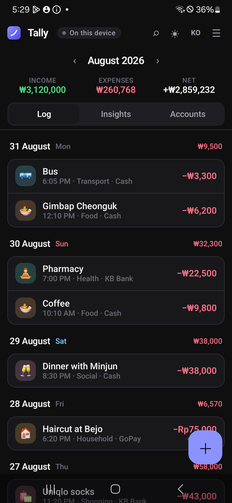
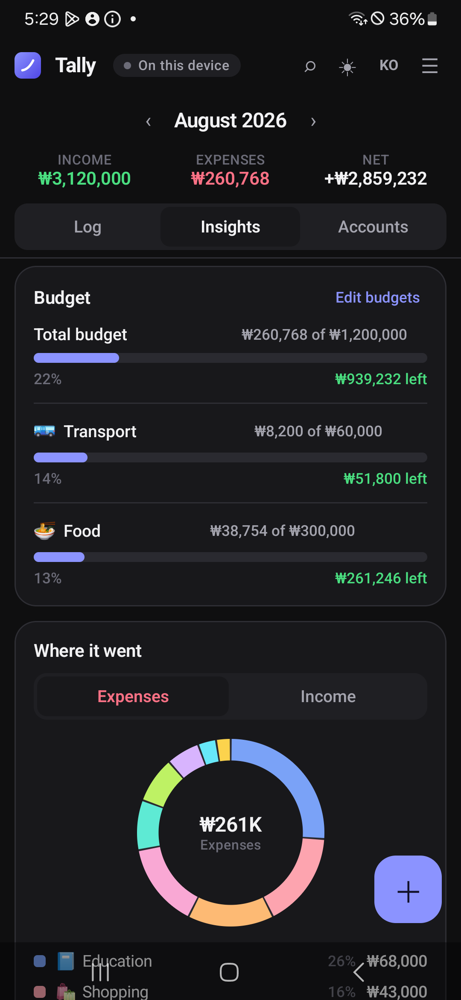
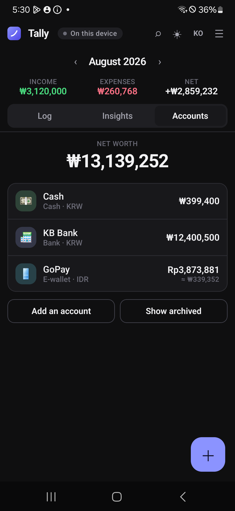
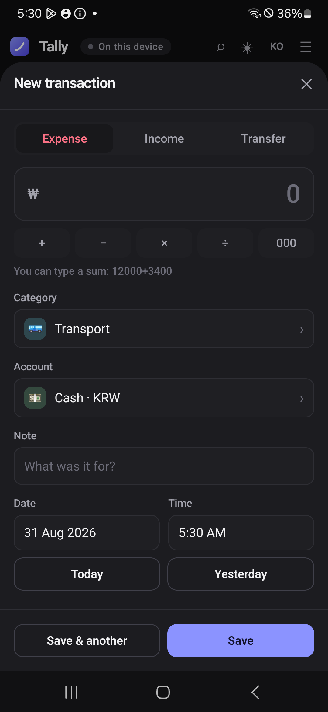
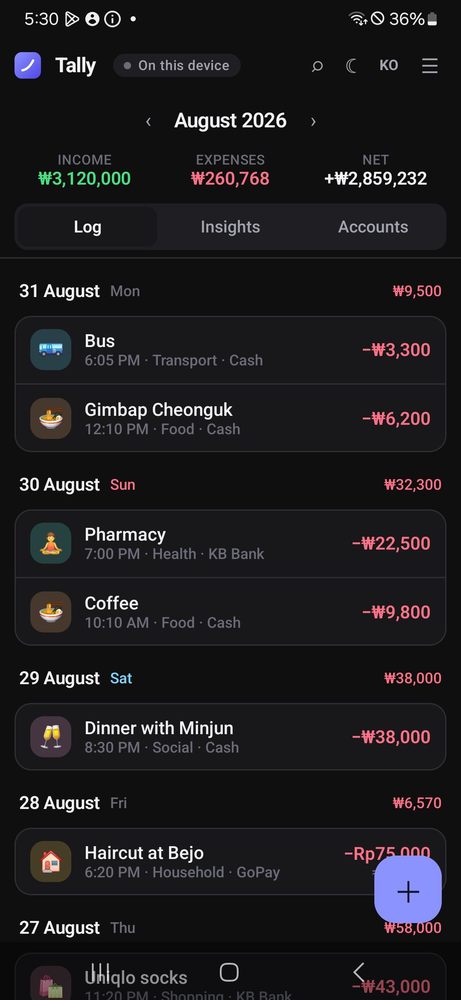
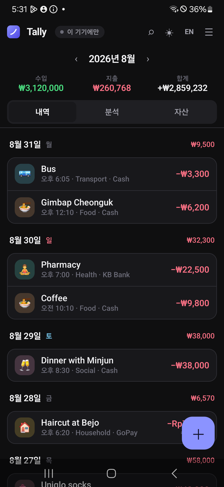
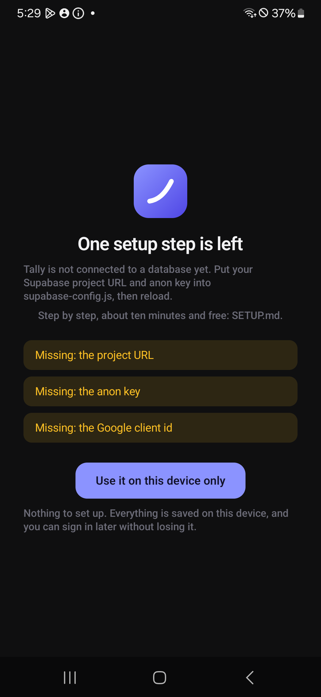
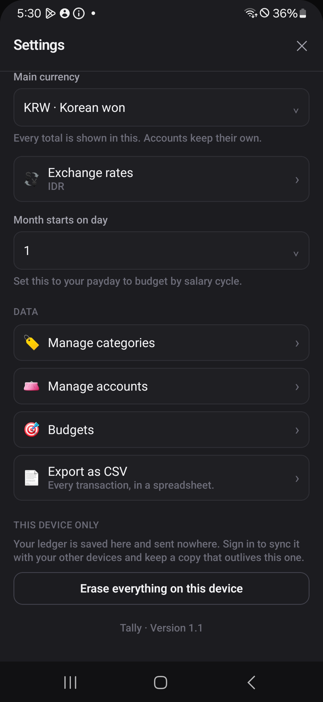

# Tally for Android

The phone half of [Tally](https://hanifedma.com/tally/) — a money manager for
people whose money is in more than one currency.

Web app: [hanifedma/tally](https://github.com/hanifedma/tally)

---

<p align="center">
  
  
  
</p>
<p align="center">
  
  
  
</p>

<p align="center"><sub>
Taken on a Galaxy A15 (Android 14) by <a href="tools/screenshots.sh">tools/screenshots.sh</a>.
The ledger in them is the one the
<a href="https://github.com/hanifedma/tally#readme">web screenshots</a> use, so
the two can be compared row by row — the same ₩260,768 of expenses, the same
₩13,139,252 of net worth, arrived at by two separate implementations.
</sub></p>

---

## What it is

The same ledger as the website, not a copy of it. Both apps read and write the
same Postgres and both listen to the same realtime stream, so an expense
entered here appears in the browser about a second later, and the other way
round.

- Kotlin, Jetpack Compose, Material 3
- **minSdk 23** — Android 6.0, which is roughly 99% of the phones in use. As
  low as Tally can go: Credential Manager's Google sign-in needs 23, and below
  that there is no sign-in to offer.
- Google sign-in through **Credential Manager**, the current API
- Works with no signal: the ledger is cached on the device and edits are queued
- **Works with no account at all** — see below
- English and Korean, dark and light — the setting lives on the account, so
  changing it on a laptop changes it here

## Without an account

**Use without an account** on the sign-in screen gives you the whole app with
nothing to set up and nothing sent anywhere. It is not a demo: it is the same
`LedgerRepository` with `local = true`, which closes every path to the network
and leaves the rules — client-made ids, soft deletes, whole-row writes —
exactly as they are. The device cache stops being an optimisation and becomes
the ledger.

Nothing is queued in that mode, on purpose. An outbox that could never drain
would be the only thing holding a row, and the file it lives in is not the one
the app treats as the ledger.

Signing in later offers, once, to copy that ledger into the account. The rows
keep their ids; only the *derived* ones — the starter categories and accounts,
whose ids come from the user id so two devices seeding one account write one
set of rows — are translated, along with every reference to them. Nothing is
erased at the far end, so a failure there loses nothing.

This is also the only way in on a phone with no Google Play Services, where
Credential Manager cannot offer an account at all.

<p align="center">
  
  
</p>

## Setup

See [**SETUP.md**](SETUP.md). It is short, because the real work is in the web
repo's [SETUP.md](https://github.com/hanifedma/tally/blob/main/SETUP.md) — one
Supabase project and one Google OAuth client serve both apps.

## Building

```bash
./gradlew assembleRelease     # app/build/outputs/apk/release/app-release.apk
./gradlew installDebug        # onto a connected device or emulator
./gradlew test                # 45 unit tests, no device needed
./gradlew connectedAndroidTest  # the screen tests; needs a device
./tools/screenshots.sh        # docs/screenshots/; needs a device
```

`tools/screenshots.sh` drives device-only mode, so it needs no Supabase
project and no Google account. It loads the same demo ledger the web
screenshots use — generated by the web repo's `tools/demo-cache.mjs` — so the
phone and the browser are photographed holding exactly the same money.

Signing is described by a `keystore.properties` at the repo root, which is not
committed — see `keystore.properties.example`. Without it the release build
falls back to the debug key: still installable, still testable, just not
something to publish, and Google sign-in will refuse it because the certificate
is not the one registered.

## Layout

```
core/       Money, Dates, Calc, Compute, Models, Ids
            — the same arithmetic as the web app's money.js
data/       Supabase, LedgerRepository, LocalStore, Prefs
auth/       AuthManager — Credential Manager → Supabase
i18n/       Strings.kt — GENERATED, do not edit
ui/         theme, TallyViewModel, TallyApp, screens/, components/
```

### `Strings.kt` is generated

It is produced from the web app's `i18n.js`:

```bash
cd ../tally && node tools/gen-android-strings.mjs ../tally-android
```

Two hand-maintained copies of two hundred and forty strings drift within a
week — a key renamed on one side and the phone quietly starts showing
`tx.saveAnother` where a button should be. So the web table is the source and
this is a build artefact that happens to be committed. `ParityTest` fails if it
falls behind, or if either language is missing a key or a `{placeholder}`.

### The parity tests

`app/src/test/.../ParityTest.kt` is not a test that Kotlin does what Kotlin
does. Every expected value in it was produced by running the *web* app's
`money.js` in Node and pasting the answer in. It asserts that the phone and the
browser put the same number on the screen for the same row — the same formatted
string, the same converted amount, the same derived UUID. If one side drifts,
it fails.

### Why the release build is not minified

Ktor and kotlinx.serialization — the two libraries the whole sync layer rests
on — resolve types reflectively at the edges, and a wrong keep rule fails at
runtime on a user's phone rather than at build time here. A few extra megabytes
is the right trade for a sync layer that cannot silently work in debug and
break in release.

## A limitation worth knowing

Google sign-in needs Google Play Services. On a phone that has none — some
Huawei models, some custom ROMs — there is no way in, and Tally will say so
rather than showing a button that cannot work. The web app works on any of them.
